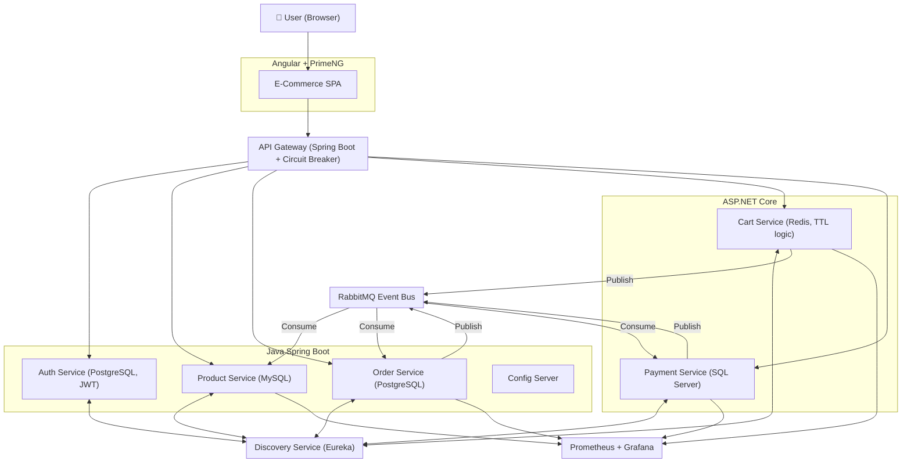
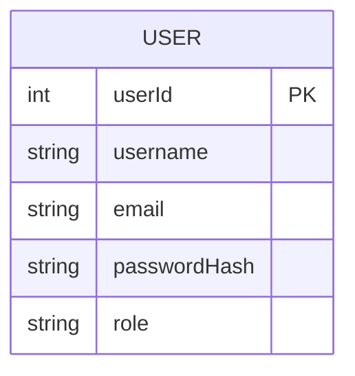
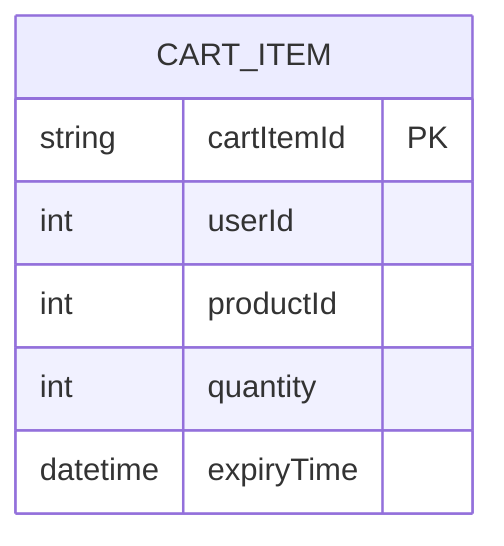
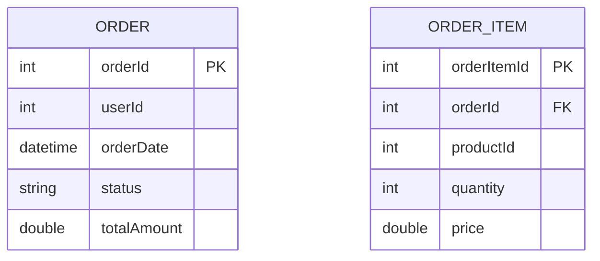
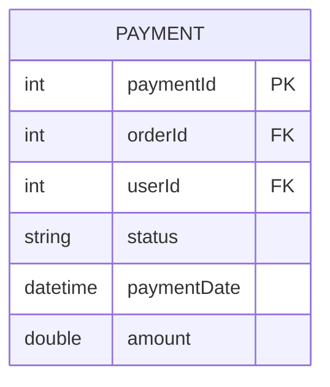
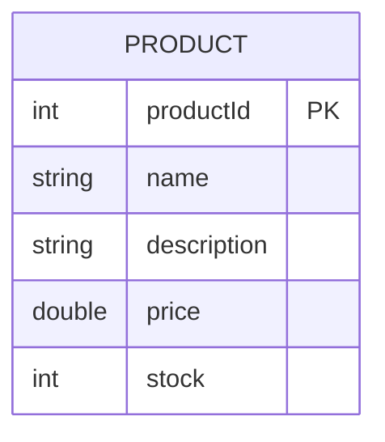
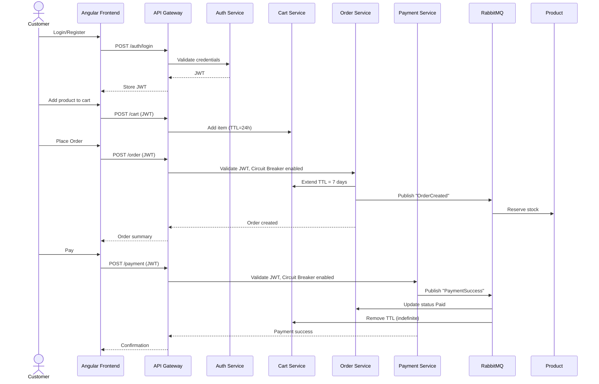

## 1. 🎯 Project Overview

This system is an **advanced-level e-commerce platform** designed for hands-on microservices experience, featuring:
- **JWT authentication** for secure user login and API access.
- **Cart service with TTL rules**:
    - Default TTL = 24 hours.
    - On order placed → 7 days.
    - On payment completed → indefinite.
- **RabbitMQ** for asynchronous communication (stock reservation, order/payment events).
- **API Gateway** + **Circuit Breaker** to protect services.
- **Dockerized microservices** for easy deployment.
- **Config server** for centralized configuration.
- **Swagger/OpenAPI** for API documentation.
- **Prometheus + Grafana** for metrics, monitoring, and dashboards.
- Angular + PrimeNG frontend for product browsing, cart, order, and payment.

---
## 2. 🏗 System Components

### **Java Spring Boot Microservices**
1. **Product Service (MySQL)**
    - CRUD products & categories.
    - Publishes stock reservation events to RabbitMQ.
    - Circuit breaker for dependent services.
2. **Order Service (PostgreSQL)**
    - Order lifecycle: Created → Confirmed → Shipped → Paid.
    - Validates JWT before placing orders.
    - Consumes RabbitMQ events to adjust stock.
    - Publishes order status events.
    - Circuit breaker applied when calling Payment or Product service.
3. **Auth Service (PostgreSQL, JWT)**
    - User registration/login.
    - Generates JWT tokens.
    - Role management: `customer`, `admin`.
4. **Config Server (Spring Boot)**
    - Centralized configuration for all services (DB URLs, RabbitMQ, Redis, JWT secrets).
    - Fetches configuration from Git or local repo.
### **C# ASP.NET Core Microservices**
5. **Cart Service (Redis)**
    - Stores user carts with TTL rules:
        - Default = 24h
        - Order placed = 7 days
        - Payment confirmed = indefinite
    - Publishes events for order placement.
6. **Payment Service (SQL Server)**
    - JWT validated.
    - Processes payments and updates order status.
    - Publishes payment success/failure to RabbitMQ.

---
### **Infrastructure**
- **API Gateway (Spring Boot + Resilience4j Circuit Breaker)**
    - JWT validation for sensitive endpoints (Order & Payment).
    - Routes requests to microservices.
- **Discovery Service (Eureka)**
    - Service registry & discovery.
- **RabbitMQ**
    - Async event bus for:
        - Stock reservation
        - Order status updates
        - Payment notifications
- **Monitoring**
    - **Prometheus** scrapes metrics from services.
    - **Grafana** visualizes metrics (cart TTLs, payment failures, order processing).
- **Docker**
    - Containerizes all microservices for consistent deployment.
- **Swagger/OpenAPI**
    - Auto-generated API docs for all services.

---

## 3. 📊 System Architecture

---

## 4. 📦 Data Models (ERD)

### Auth Service

---

### Cart Service (Redis – TTL)

**TTL Rules:**
- Default = 24h
- Order placed = 7 days
- Payment confirmed = indefinite

---

### Order Service

---

### Payment Service

---

### Product Service

---

## 5. 🔄 Functional Flow (JWT + TTL + RabbitMQ + Circuit Breaker)

---

## 6. 🚀 Functionalities

- **Wishlist** (part of Cart or separate Redis DB).
- **Stock Reservation** through RabbitMQ prevents overselling.
- **Async Email/Notification Service** consuming RabbitMQ events.
- **Circuit Breaker** on API Gateway to prevent cascading failures.
- **Docker Compose** setup for all microservices + RabbitMQ + Redis + DBs.
- **Centralized Config Server** for environment-specific configuration.
- **Monitoring + Metrics**:
    - Track cart expirations, order success rate, payment failures.
    - Grafana dashboards visualizing service health.

---
## 7. ✅ Non-Functional Requirements

- **Security:** JWT validated at Gateway + Services.
- **Resilience:** Circuit breaker protects from downstream failures.
- **Scalability:** Microservices can scale independently.
- **Observability:** Prometheus + Grafana for metrics, logs optional.
- **Documentation:** Swagger/OpenAPI for all REST APIs.
- **Deployment:** Docker containers for all services and infrastructure.

---
## 8. 📦 Deliverables

- 2 Java Spring Boot services (Product, Order).
- 1 Java Auth service (JWT).
- 1 Java Config Server.
- 2 ASP.NET Core services (Cart, Payment).
- API Gateway + Discovery (Spring Boot).
- RabbitMQ integration.
- Angular + PrimeNG frontend.
- Docker Compose setup.
- Swagger/OpenAPI documentation.
- Prometheus + Grafana dashboards.

---
# 🔹 Grafana Dashboards to Build
Here are **dashboard ideas** you can build for your e-commerce app:
1. **System Health Dashboard**
    - CPU, memory, DB connections, Redis hits
2. **Orders & Revenue Dashboard**
    - Orders placed today, revenue trend, failed payments
3. **Customer Experience Dashboard**
    - API latency, error rate, cart abandonment
4. **Marketing Dashboard**
    - Traffic spikes, referral sources, conversion funnel

---
# 🔹 Real Example Flow
Imagine you have:
- **Spring Boot Order Service** → exposes `orders_created_total`
- **.NET Payment Service** → exposes `payment_success_total`, `payment_failure_total`
- **Prometheus** scrapes both services
- **Grafana** shows:
    - Orders created vs orders paid
    - Revenue trend over last 7 days
    - Payment failure spikes (could be PayPal/Stripe outage)

---
## Tech Stack
- [[Java Spring Boot]]
- [[Angular]]
- [[Grafana]]
- [[Prometheus]]
- [[Docker]]
- [[ASP.NET]]
- [[RabbitMQ]]